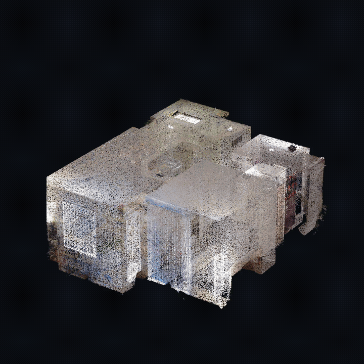
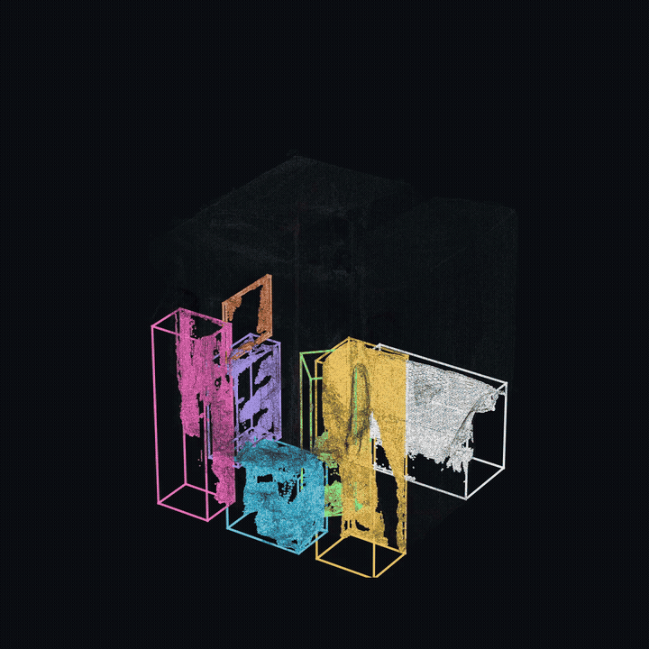
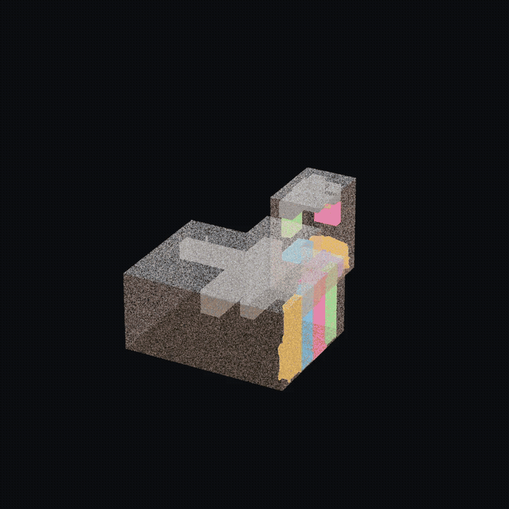

# Roomform

Parses point cloud indoor scans into structured, editable
scenes: room boundaries (walls, floors, ceilings — inferred
through occlusion) + objects out.



## Docs

- [Data contracts](docs/data-contracts.md) — the pipeline spine:
  `ScanInput -> EvidenceGrid -> PatchGraph -> SceneDocument`
- [How the model works](roomform/model/README.md) — the patch-graph
  ConvFormer: representation, architecture, measured results
- [Research](research/README.md) — training, experiments, and the
  parity rules

## Setup

Requires [uv](https://docs.astral.sh/uv/). Install with the extras you
need:

    uv sync --extra model --extra modal --extra dev

| extra   | pulls in            | needed for                          |
|---------|---------------------|-------------------------------------|
| `model` | torch               | boundary completion (local inference) |
| `modal` | modal               | SpatialLM lifting on Modal          |
| `fal`   | fal-client, pillow  | live SAM 3D object reconstruction   |
| `agent` | anthropic, openai, matplotlib | envelope completion (VLM-judged fills) |
| `dev`   | ruff, pytest, pyyaml| lint + tests                        |

Credentials, only for the stages that use them:

- Modal (lifting): `uv run modal setup` once.
- FAL (SAM 3D): put `FAL_KEY=...` in `.env` (gitignored).

## Checkpoint

Weights live on the Hugging Face Hub at
[jchiu/roomform](https://huggingface.co/jchiu/roomform) (CC BY-NC 4.0)
and the pipeline downloads the default automatically on first run —
or drop any checkpoint at
`checkpoints/patch-graph-joint-rgb-55m-offset-head-r2.pt` yourself
(`--ckpt` overrides the path). Checkpoints
are `{"model": state_dict, "config": {...}}`; the config dict is what
`roomform.model.config.ModelConfig` reads, so any compatible training
run loads directly. Without a checkpoint the pipeline falls back to
random weights and marks the shell `RANDOM-INIT` (excluded from
exports).

## Quickstart without a scan

A pre-baked result ships in [samples/](samples/README.md):

    uv run python viewer/serve.py --artifacts samples   # :8790

`samples/README.md` also lists public-domain scans to download for
full pipeline runs.

## Run the pipeline

    uv run python -m roomform.pipe.e2e SCAN.ply

- `SCAN.ply` — a registered point cloud (colors optional; normals are
  PCA-estimated when missing). An `.npz` with `pts` / `pts_normal` /
  `pts_color` works too.
- Output goes to `artifacts/<scan-stem>/`: `evidence.npz`,
  `patchgraph.npz`, `proposals.txt`, `scene.json`, `scene.glb`.
- Progress streams as NDJSON events on stdout; a shell-only
  `scene.partial.json` is emitted seconds in, while SpatialLM lifting
  finishes on Modal (spawned first, runs concurrently).
- `--proposals FILE` reuses existing SpatialLM output and skips Modal
  entirely (fully local, ~10 s per scene on CPU).
- `--sequential` disables the parallel DAG for debugging.

Attach reconstructed object meshes (optional):

```python
from roomform.pipe.objects.reconstruction.sam3d import adopt_meshes, reconstruct_live
```

`adopt_meshes` matches existing aligned GLBs to objects by center and
copies them into the scene's artifact dir; `reconstruct_live` calls
FAL SAM 3D on an object crop image (needs `FAL_KEY`).

Object lifting backends (`--lifter`), with upstream licenses:

| backend | model | upstream license |
|---|---|---|
| `pointlabel` (default) | PTv3 ScanNet semseg + local clustering | MIT (ScanNet data ToU applies) |
| `spatiallm` | SpatialLM 1.1 Qwen-0.5B | CC BY-NC 4.0 |
| `unidet3d` (eval) | UniDet3D multi-dataset detector | CC BY-NC 4.0, axis-aligned boxes |

## View and edit results

Two surfaces, two jobs:

**Debug viewer** — inspect what the pipeline produced:

    uv run python viewer/serve.py          # http://127.0.0.1:8790

Single-file three.js viewer over `artifacts/`: RGB cloud, boundary
class layers, voxel evidence, detection boxes — plus curation for QA
(drag on the floor plane, shift-drag raises, Q/E rotate, WASD nudge,
delete/rename) with Save writing `scene.json` back.

**Production editor** — the scene-editing product UX. Scenes export
into its fixture format and appear at runtime, no editor changes:

    uv run python -m roomform.export fixtures artifacts/<scene>
    uv run python viewer/serve_demo.py PATH/TO/editor/dist   # :8792

Point `--fixtures` (or the `ROOMFORM_FIXTURES` env var) at the
editor build's fixtures directory.

`scene.glb` is also self-contained: drop it into any glTF viewer.

Standalone GLB export: `uv run python -m roomform.export glb
artifacts/<scene>/scene.json out.glb --evidence
artifacts/<scene>/evidence.npz`.

## More demos

| objects | training |
|---|---|
|  |  |

## Tests and lint

    uv run pytest tests/
    uv run ruff format . && uv run ruff check .

`tests/test_parity.py` is the contract that matters: every checkpoint
written in the documented format must round-trip through
`roomform.inference.local`.

## Layout

    roomform/
    ├── roomform/            the pip package
    │   ├── contracts/       pydantic documents (the spine)
    │   ├── pipe/            evidence -> lifting -> reconstruction -> fuse, e2e driver
    │   ├── model/           patch-graph ConvFormer (the ONE architecture)
    │   ├── inference/       local runner + Modal adapter (StageApp)
    │   ├── agent/           envelope completion (VLM judge, Claude/OpenAI)
    │   ├── export.py        scene.glb + demo-editor fixture exports
    │   └── eval.py          shell/connectivity F1 metrics
    ├── viewer/              web viewers + dev servers (not in the wheel)
    ├── research/            training loop + experiments (never
    │                        defines architectures or metrics — parity
    │                        with the package is enforced by tests)
    ├── docs/                data contracts + migration log
    └── artifacts/           pipeline outputs (gitignored)

## Citation

If you use roomform in your research, please cite:

```bibtex
@software{roomform2026,
  title   = {roomform: parsing point cloud indoor scans into structured, editable scenes},
  author  = {Chiu, Johnathan and Zhou, Matthew and Bourne, Preston},
  year    = {2026},
  version = {0.1.0},
  url     = {https://github.com/johnathanchiu/roomform},
}
```

Object lifting uses [SpatialLM](https://huggingface.co/manycore-research/SpatialLM1.1-Qwen-0.5B)
(Manycore Research); object mesh reconstruction uses
[SAM 3D Objects](https://ai.meta.com/sam3d/) (Meta) via
[fal.ai](https://fal.ai/models/fal-ai/sam-3/3d-objects).
Benchmark scenes in the docs come from
[Redwood](http://redwood-data.org/indoor/),
[ARKitScenes](https://github.com/apple/ARKitScenes),
[SceneNN](https://hkust-vgd.github.io/scenenn/),
[CV4AEC](https://cv4aec.github.io/), and
[HouseLayout3D](https://houselayout3d.github.io/).

## Supported by

<p>
  <a href="https://modal.com"></a>
</p>

This work is generously supported by [Modal](https://modal.com) and
[Akshat Bubna](https://github.com/aksh-at)
([@akshat_b](https://x.com/akshat_b)).

## License

- Code: [Apache 2.0](LICENSE)
- Trained weights/checkpoints and the synthetic data generation code
  (`research/datagen/`, when published): [CC BY-NC 4.0](LICENSE-WEIGHTS)
  — free for research; commercial use needs a separate license.
